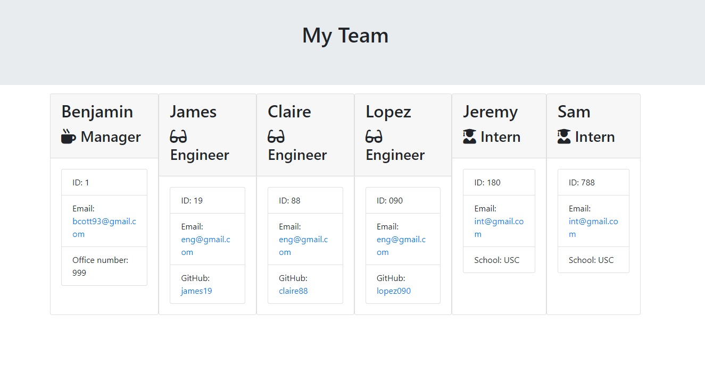

# ReadMeGenerator

In this Challenge, I was tasked with building a command-line application that dynamically generates a software engineering team's HTML webpage with a summary for each team member. I was also tasked with passing the tests provided in the starter code.

## The Goal

To create a HTML page with summaries of each team member. The team members were to be generated via user input. 

- Create a command-line application that accepts the following user input;

    - Team Manager
        - Name
        - ID
        - Email Address 
    - Engineer/s
        - Name
        - ID
        - Email
        - GitHub
    - Intern/s
        - Name
        - ID
        - Email
        - School

The user will add a team manager, and then be presented with a choice to add either an engineer or an intern. This choice will be presented continuously until they are ready to finalise their team. At which point, the HTML page will be generated.

User input will be validated at each stage.  

### Usage

To view the project, please follow the links below

https://github.com/Bcott93/Team-Profile-Generator

### Credits:

* [Node.js FileSystem](https://nodejs.org/api/fs.html)
* [NPM Inquirer](https://www.npmjs.com/package/inquirer)

### License

Please see the License in the Repo. 

